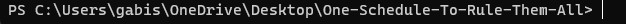
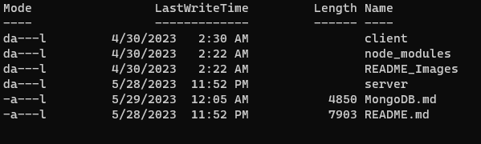
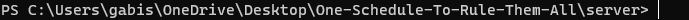
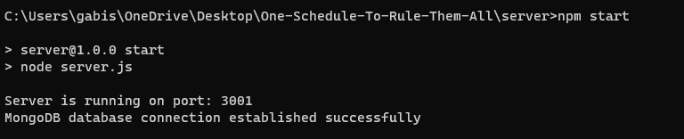

# Notes For Passing Over The System

## Github

Github is a very popular cloud based platform that provides programmers a centralized location for software development and version control. It allows multiple people to work on the same project, it allows for saving progress in in such a way that we may go back to old progress whenever we wish, as well as it allows the ability to branch off from a project's progress to explore different functionalities without affecting the main project.

We will be passing the software to you VIA github. This way, the software can never be lost and you may, if you desire, hire someone to work and maintain the project directly. Whomever is being trusted to become owner of this project will need to make a github account and send Gabriela Santiago their username and email associated with the created account. This way, we can invite you to the project's organization and properly transfer ownership of it. From there, you should have full access to the project and you may remove us from the organization if you wish in the project's settings.

## MongoDB

This is the database we chose for this application. It is a No SQL database which is known for its fast speeds and is a great choice when making an application that you anticipate growth in.

# Documentation for Downloading MongoDB Community Edition to Microsoft Server 2019

## Step: 1: Creating Space For The Database in The Root Folder

- In the root folder, otherwise known as the C-Drive on windows, create a folder named "data". Within this new folder, create another folder named "db". To access the C-Drive, you can click on the File Explorer, select "This PC", then select your C-Drive.

## Step 2: Installing Mongosh

- First, open the MongoDB Shell download page here:  https://www.mongodb.com/try/download/shell

- Under "MongoDB Shell Download" select a proper platform and click "Download" to download the zip file for Mongosh.

- Unzip the downloaded Mongosh installer file and double-click it.

- Follow the installation prompts to properly install Mongosh.

- Note that sometimes the downloaded file will be a folder already containing the application for mongosh within the "bin" folder of the downloaded folder. In that case you may simply open mongosh from that bin folder.

## Step: 3: Installing MongoDB Community edition

- Download the MongoDB Community .msi installer from the following link: https://www.mongodb.com/try/download/community

- Under "MongoDB Community Server Download" select a proper platform and click "Download" to download the msi file for Mongosh.

- Double-Click the downloaded msi file.

- Follow the MongoDB Community Edition installation wizard. The wizard steps you through the installation of MongoDB and MongoDB Compass. You can choose either the Complete (recommended for most users) or Custom setup type. The Complete setup option installs MongoDB and the MongoDB tools to the default location. The Custom setup option allows you to specify which executables are installed and where. Be sure to install MongoDB Compass as well. It is a very useful tool in viewing and editing the database that will be created. This can be done via the Community Edition installation wizard by making sure the check box when installing the community version is checked.

## Step 4: React Project Setup

This project has been created using ReactJS. In order to run either the server or client of this project, certain crucial dependancies will be required.

- Node.js: Visit the official Node.js website (https://nodejs.org) and download the appropriate installer for your operating system which is Windows Server 2019. Node.js includes both Node.js runtime and npm (Node Package Manager). 

- To verify that node has been installed successfully, Open a terminal or command prompt and run the command "-v" excluding quotation to check if Node.js and npm are installed correctly. Press enter and the current node version should be displayed.

- The Project: If it has not been done already, download the latest version of Project: One Schedule to Rule Them All via GitHub. This is a private repository, so contact gabisgr8@gmail.com with your github account email to gain access to the project repository. Once you have been given access to the repository, select it. On the right side of the screen, there should be a green button labelled "Code". Select it, then select "Download ZIP". This will download our project in its entirety.

- When the project has finished downloading, unzip it by right-clicking on it and selecting "Extract All". Once the project folder has been extracted, you will now have access to the project.

- Lastly, using a terminal or command prompt locate the project using the "cd" and "ls"/"dir" commands. "cd" will allow you to navigate folders on the PC. "ls"/"dir" is a command that lists the files and folders in the current working directory. If you are using Windows PowerShell, the command will be "ls". If you are using the Command Prompt, the command will be "dir". Should you wish to go back a directory, the correct command to use for either one is "cd ..". None of these commands include their quotations. For example, Gabriela has saved the project folder on her Desktop directory. The figure below displays what the directory looks like on her CommandShell:

</img>

Using the "ls" command, we are able to view the directories in this folder. The directory we will be navigating to is named "server". Below is a figure of what the directories in the project should look like after using the "ls" or "dir" command:

</img>

Now navigate to the server directory using the "cd" command. After typing "cd server" into the shell and pressing enter the directory should change to the image below to reflect that you are now in the server folder:

</img>

Once in the server folder, use the command "npm install". This will automatically install all of the dependancies we have used for the backend of this project. The installation of Node.JS we completed above has allowed us to use npm commands. Wait for the dependancies to finish installing.

## NOTE: STOP HERE BUT LEAVE THE TERMINAL/POWERSHELL WINDOW OPEN AND MOVE ON TO STEP 5

## Step 5: Running the Server Locally

- First, open mongosh. A command prompt window should open prompting you to enter a MongoDB connection string.

- Enter or copy paste without the first and last quotations "mongodb://127.0.0.1:27017/Team-KingPin" and press enter. Do not do anything else with mongosh.

- Go back to the Terminal/PowerShell and run the server using "npm start" when inside the project's server folder, which is where you should already be. This will create the database with all the proper collections. The response should be as listed below:

</img>

    NOTE: We use port 3001 for the server port of this project. Should this port already be in use on your servers. Let Gabriela know at (gabisgr8@gmail.com) and provide her the number of an open port on your server and she will update the project accordingly.

- Open MongoDB Compass and press connect to connect to your now running database. Do not type anything in the text box.

- You can see the database named "Team-KingPin" in the left hand side of the Compass window. Click on it.

- If you need to inject any data by hand, go into a collection and input the data in the proper format (such as a admin user to login with). 

## Step 6: Adding Data (User)

- Click on the Team-Kingpin database in Compass and click on the "users" collection from the drop down.

- Click the "Add Data" button and select "Insert Document".

- Copy and Paste this line without the first and last set of quotations into the box and click Insert:
"{"_id":{"$oid":"63fed6f8b22d16dd3c41683e"},"email":"admin@test.com","password":"admin","userType":"admin","firstName":"admin","lastName":"admin","updatedAt":{"$date":{"$numberLong":"1680621570851"}},"crewPosition":"mso","syllabus":"apple"}"

- The user should pop up in the collection. 

## The database should be properly set up from here. Should any issues, questions, or concerns arise, contact Gabriela at (gabisgr8@gmail.com). She will be happy to assist in any way she can.